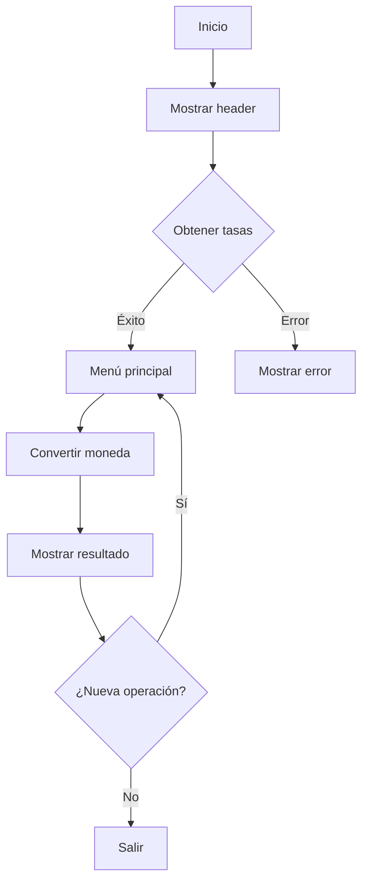

# currency-converter

# Conversor de Monedas con API de ExchangeRate-API

## 📌 Índice
1. [Descripción](#-descripción)
2. [Funcionalidades](#-funcionalidades)  
3. [Tecnologías](#-tecnologías-utilizadas)
4. [Requisitos](#-requisitos-del-sistema)
5. [Instalación](#-instalación)
6. [Uso](#%EF%B8%8F-uso)
7. [Estructura](#%EF%B8%8F-estructura-del-código)
8. [Flujo](#-flujo-de-la-aplicación)
9. [API](#-api-externa)
10. [Mejoras](#-posibles-mejoras)
11. [Desarrollador](#-desarrollador)

## 🌟 Descripción
Aplicación Java CLI para conversión monetaria en tiempo real usando [ExchangeRate-API](https://www.exchangerate-api.com/).

**Características principales**:
- Consulta tasas actualizadas
- Conversión entre 160+ divisas
- Interfaz intuitiva por consola

## 🚀 Funcionalidades
| Función | Descripción |
|---------|-------------|
| Conversión en tiempo real | Usa tasas actualizadas de la API |
| Gestión de moneda base | Permite cambiar la moneda de referencia |
| Validación de inputs | Controla errores en entradas |
| Listado completo | Muestra todas las divisas disponibles |

## 💻 Tecnologías Utilizadas
```java
// Stack técnico
- Java 11+
- Google Gson (JSON)
- Java HttpClient
```

## 📋 Requisitos del Sistema
- JDK 11 o superior
- API Key de ExchangeRate-API
- Conexión a internet
- IDE IntelliJ IDEA

## 🔧 Instalación
```bash
# 1. Clonar repositorio
git clone https://github.com/WilmarDeML/currency-converter.git
cd currency-converter

# 2. Configurar API Key (en ExchangeService.java)
private static final String API_KEY = "tu-key-aquí";

# 3. Descargar el archivo JAR de Gson

    ° En IntelliJ IDEA:

    ° File > Project Structure > Modules > Dependencies

    ° Click en "+" > JARs or directories

    ° Seleccionar el archivo gson-2.X.X.jar
```

## 🖥️ Uso
1. Seleccionar moneda base (ej: COP)
2. Ingresar cantidad a convertir
3. Elegir moneda destino (ej: USD)
4. Ver resultado de conversión
5. Opciones posteriores:
   - Nueva conversión (1)
   - Cambiar base (2)
   - Salir (9)

## 🏗️ Estructura del Código
| Archivo | Responsabilidad |
|---------|-----------------|
| `Main.java` | Punto de entrada |
| `MainService.java` | Lógica de UI y flujo |
| `ExchangeService.java` | Conexión con API |
| `MyHttpClient.java` | Cliente HTTP |

## 🔄 Flujo de la Aplicación


## 🌐 API Externa
**Endpoint**: `https://v6.exchangerate-api.com/v6/{API_KEY}/latest/{BASE_CODE}`

**Ejemplo de respuesta**:
```json
{
  "conversion_rates": {
    "USD": 1.0,
    "EUR": 0.92,
    "COP": 4100.0
    ...
  }
}
```

## 🔮 Posibles Mejoras
1. ✅ Historial de conversiones
2. 🖥️ Interfaz gráfica
3. 💾 Cache local de tasas
4. 🧪 Suite de pruebas unitarias

## ✨ Desarrollador

**Creado por**: WilmarDeMelquisedecLisbet

[](https://github.com/WilmarDeML)
[](https://linkedin.com/in/wilmardeml-dev)

📌 *¿Problemas o sugerencias?*  
Abre un [issue](https://github.com/WilmarDeML/currency-converter/issues) en el repositorio.


## 📄 Licencia
MIT License - Ver archivo [LICENSE](LICENSE)
